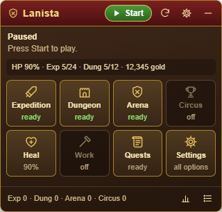
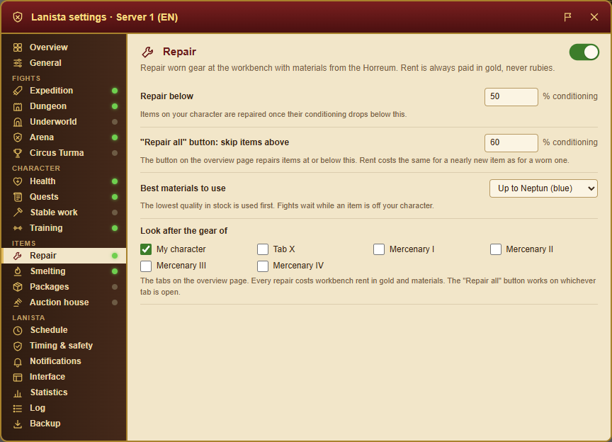
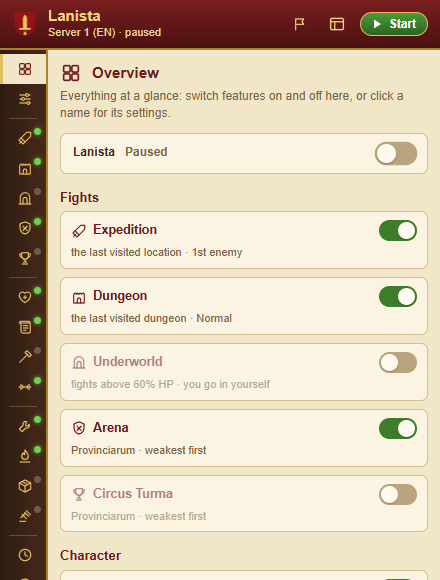

# Lanista

In ancient Rome a *lanista* ran a gladiator school: he trained the fighters, sent them into the
arena and kept the whole business going. That's pretty much what this does for your
[Gladiatus](https://gladiatus.gameforge.com) character.

Lanista is a browser extension for **Chrome** (plus Edge, Brave and Opera) and **Firefox**. It sits
in your normal game tab and plays the way you would: it clicks through expeditions, dungeons, the
arena and everything around them, and keeps an eye on your health, gear and packages while it's at
it. (It used to be called GBot.)

> **Heads-up before you start:** Gameforge's rules don't allow automating the game. Using Lanista
> can get your account suspended or banned. It's your call and your risk.

 

## What it can do

### Fighting

- **Expeditions.** Pick a location (or just use the last one you visited) and an enemy, and it
  attacks whenever the cooldown is up. It can keep a few points in reserve. Farming the boss? It can
  first beat the other enemies there until you've learned all their bonuses, so the boss gets them
  too ([more below](#expedition-bonuses-before-the-boss)). And if it keeps losing to one enemy, it
  can drop to an easier one for an hour before trying again.
- **Dungeons.** Starts a Normal or Advanced dungeon when none is running (Normal if Advanced isn't
  unlocked yet) and works through the enemies. Not a fan of the boss? Tell it to skip bosses: it
  clears everyone else, then cancels the dungeon and starts a fresh one. It can also start over after
  a few losses in a row.
- **Arena and Circus Turma**, in the Provinciarum (players from other servers) or on your own
  server. Go for the weakest, the strongest or a random opponent, stay near your own level, keep a
  never-attack list, and steer clear of anyone who beat you recently. Optionally it goes back to
  people you've already beaten first. Your buddies are never attacked, and you can cap the attacks
  per player and per day. On your own server the game
  only shows the players ranked just above you, without levels, so "weakest" means the next rank
  up. The local Circus also needs your participation status set to Active; Lanista leaves that
  switch to you.
- **The Underworld.** From level 100 it fights its way through the Underworld for you, carefully,
  since a bad fight there can get you kicked out for days
  ([more below](#the-underworld)).
- **Enemy nests.** When the game offers to search a nest after a win, it does a quick or thorough
  search, or heads back to safety, whichever you like.

### Keeping you alive

- **Healing.** Eats when your HP drops below one limit and stops fighting below another. It picks the
  food that best fills the gap.
- **Food bags.** Tell it which inventory bags hold its food, and your other bags are safe. When
  those bags run dry it grabs food from your packages.
- **Plain food only.** Eggs that give rubies or skip cooldowns, Cervisia that turns on Centurio and
  other goodies stay untouched (you can switch this off).
- **Food from the auction house.** Optionally bids on cheap food in the auction house, late in the
  round when you're least likely to be outbid, within a budget you set. Heads-up: the game keeps
  your gold if someone outbids you, so it bids once per item and never early. It can bid on gear
  too: the kinds you pick, from a minimum quality, up to a price per lot.
- **Food from the market and the merchants.** When the food bags and the packages are both empty,
  it can buy a few pieces from other players on the public market (only ones that heal enough HP per
  gold) and then from the General goods merchant, best HP per gold first, within a daily budget and
  never below the gold you want to keep. The merchants are pricier than the auction house, so think
  of them as a backup.
- **The guild doctors.** If your guild has the Villa Medici, Lanista can see its doctors for free
  heals: in the Underworld (where you can't eat) instead of waiting for HP to come back, or anywhere
  before eating food. Each doctor rests a couple of hours afterwards, and you can cap how many it
  sees a day.

### Gear and loot

- **Repairs.** When something you're wearing gets worn down, it takes it off, fixes it at the
  workbench with materials from your Horreum (cheapest first, up to the quality you allow) and puts
  it back on. There's also a **Repair all** button on the overview page, on your character and on
  each mercenary's tab ([more below](#repairs)).
- **Smelting.** Tick items on the packages page (or tick a whole page at once), or let rules pick
  them by quality and kind. You can also set aside a bag or two as a *smelt bin*: whatever you drop
  in gets smelted. It keeps the smelter busy and puts the resources in the Horreum.
- **Tidying the packages.** Takes gold out of gold packages, stores resources in the Horreum, sells
  gear you don't want to a merchant, and rescues packages that are about to expire
  ([more below](#tidying-the-packages)). It can also take chosen things out into your bags
  (upgrades, boosts, scrolls, recipes, tools, mercenary items) and learn scrolls you don't know yet.
  There's also a one-click **Store all resources in the Horreum** button on the packages page.

### Everything else

- **Training.** Spends gold above a reserve on stats, always the cheapest of the ones you pick, so
  they grow evenly. Spent gold can't be stolen in the arena, either.
- **The gods' favour.** Instead of letting favour pile up, it buys the blessings and holy oils you
  tick whenever they're off cooldown, optionally only once a god's favour is nearly full. Favour
  only, never rubies.
- **Boosts.** Keeps the stats you pick boosted with potions from your bags and packages, the
  longest-lasting first. A stat already at its maximum for your level gains nothing, so no potion
  is wasted on it.
- **Costumes.** Puts on Dīs Pater's Armour as soon as it may (which also lets it go back into the
  Underworld on that level), never touches it while it lasts, and otherwise wears the costume you
  pick.
- **Keeping gold safe.** Gold on hand gets stolen when someone beats you in the arena. Lanista can
  keep everything above a limit in your guild's market as *gold packs*: it buys the dearest pack a
  guildmate listed that your spare gold covers and lists it again at the same price. When a
  guildmate buys it, the gold comes back as a gold package, safe in your packages.
- **Stable work.** Takes a job once you're out of expedition and dungeon points.
- **Pantheon quests.** Hands in finished quests and picks up the best-paying new ones of the kinds you
  want, skipping ones for places you don't fight at. A failed quest gets another go (twice a day at
  most); one it wouldn't do anyway is dropped, so it doesn't hog a slot. It can also skip quests with
  a time limit or a food reward, and go for the most gold, honour or experience.
- **Point refills.** If you want, it uses Gate Keys and Mobilisations you already own when your
  points run out, up to a daily limit.
- **Small stuff.** Grabs the daily login bonus and closes pop-ups.

### It never spends rubies

Not on rent, not on bonuses, not on Buyout. Lanista never presses the buttons that skip a
dungeon cooldown, shorten the trip to the Underworld, or attack there without points. Items like
Mobilisations are only used if you already own them and turned that on, and they're never bought.

## A closer look

### The Underworld

Once you're level 100, the Hermit will send you down for 8,000 gold. It has four areas with three
enemies and a boss each, and Dīs Pater waiting at the end. Down there you get a separate pool of 18
expedition points, there are no dungeons, and you can't eat food.

With *Underworld* switched on, Lanista fights the newest area and whichever enemy is up next, and
leaves the stakes slider alone. Since hitting 0 HP down there only offers you the exit (and leaving
locks the Underworld for days), it waits for your HP to come back above your limit (60% by default)
before each fight. It never clicks *Leave the Underworld*, and it only ever closes the game's pop-ups
there rather than answering them. When your points run out, it stops, because the next attack would
cost rubies.

A few extras if you want them:

- **Enter automatically.** It takes the Hermit's offer again on Normal, Middle or Hard as soon as
  you're allowed back, and waits out the trip. One exception: if you still have Dīs Pater's Armor
  from that level waiting to be used, beating him again wouldn't give you another one, so Lanista
  stays out and lets you know.
- **Mobilisations.** Uses ones you own (+3 points each) when the points run out, up to a number per
  visit.
- **100% Healing Potions.** Uses ones you own when HP gets really low, also up to a number per visit.

### Expedition bonuses before the boss

Every expedition enemy has four bonuses (gold, experience, item chance and honour). Each win has a
chance to teach you one you're missing. The chance is in the bonus tooltip and depends on you and the
enemy. Once you've learned a bonus from enemies 1 to 3, the boss gets it too.

Pick the boss, switch on *Before the boss, learn the other enemies' bonuses*, and Lanista works
through enemies 1 to 3 first, then moves on to the boss. The log keeps you posted, for example
*"Skeleton Berserker has 4 bonuses left to learn (25% per win), fighting it before the boss"*.
Bonuses you've turned off with rubies can't be learned in a fight, so it doesn't wait for those.

### Repairs

When an item drops below your *Repair below* limit (50% by default), Lanista:

1. takes it off into a free spot in your bags,
2. checks the Horreum for what the workbench wants, lowest quality first and never above the quality
   you allow (Neptun, blue, by default),
3. rents a workbench slot for gold and starts the repair,
4. picks the item up from your packages and puts it back on.

Fights wait while something is off. No materials? The item goes straight back on and it tries again
in 6 hours. And if something goes wrong halfway, it puts the item back on or tells you in the log
exactly where it is.

The **Repair all** button repairs everything at or below a cutoff (60% by default), worst first,
even while Lanista is stopped. It's on your character's overview and on tab X and every mercenary's
tab too. Under *Repair* you can choose whose gear the automatic repair looks after (just your
character, unless you tick more).

### Tidying the packages

Under *Smelting* and *Packages* you set simple rules by quality (Standard, Ceres, Neptun and up) and
kind (weapons, armour, rings and amulets). Every 30 minutes Lanista goes through your packages and:

1. opens gold packages, so the gold lands on your character,
2. moves resources into the Horreum, if you want,
3. queues gear that matches a smelting rule, as if you'd ticked it,
4. sells gear that matches a selling rule to a merchant,
5. rescues packages that are about to expire (less than 24 hours left by default) by moving them into
   your bags, or sells them.

Items you ticked for smelting are never sold, smelting rules come before selling rules, and anything
that matches nothing stays put. Names you put on the *Never sell or smelt* list are left alone too.
It's all off until you turn it on.

## Getting around

### The control bar

It's on every game page:

- **Start / Stop** turns Lanista on and off.
- **Check now** makes it look at the game right away.
- **Minimise** folds the bar down to its title.
- The status line shows what it's doing, what's next and when, plus your HP, points and gold.
- The **activity tiles** switch things on and off with a click and show how each one is doing:
  *ready*, a countdown, *no points*, *low HP*, *paused* or *off*. Hover a tile and click its little
  gear for that activity's settings.
- At the bottom you get the last log line and a quick tally for the session.

Drag the bar anywhere you like and it'll remember the spot. If you'd rather not have it floating,
dock it along the top of the page under *Interface*, and it'll push the game down instead of
covering it:


### Settings

Open them with the gear on the bar, the *Settings* tile, or a tile's own gear. They open on the
**Overview**: every feature with its on/off switch and a line about how it's set up, for example
*Koman Mountain · the boss (bonuses first) · 1 Mobilisation a day*. Click a name to jump to its
tab. The tabs on the left are grouped, the green dots show what's switched on, and changes save and
apply as you go.

| Tab | What you'll find there |
| --- | --- |
| Overview | Everything at a glance, with a switch for each feature |
| General | The main on/off switch, which activity goes first, what to do with enemy nests, logging back in through the lobby |
| **Fights** | |
| Expedition | Location, which enemy, learning bonuses before the boss, an easier enemy after losses, points to keep, Mobilisations per day |
| Dungeon | Location, Normal or Advanced, points to keep, skipping the boss, starting over after losses, Gate Keys per day |
| Underworld | Fighting on/off, the HP limit, entering automatically, Mobilisations and healing potions per visit |
| Arena / Circus Turma | Provinciarum or your own server, who to attack, level range, never-attack list, avoiding people who beat you, going back to people you beat, limits per player and per day |
| **Character** | |
| Health | Eating on/off, when to eat, when to stop fighting, which bags hold food, plain food only, buying food on the market and from the merchants, the guild doctors |
| Quests | Which quest types, only quests that fit what you're doing, skipping time limits and food rewards, gold, honour or experience first |
| Stable work | Which job, how many hours |
| Training | Gold to keep, which stats |
| Gods | Which blessings, holy oils and great blessings to buy with favour, and how full a god's favour must be first |
| Boosts | Which stats to keep boosted |
| Costumes | Which Dīs Pater's Armour to put on, and the costume to wear otherwise |
| **Items** | |
| Gold | Keeping gold above a limit in guild market gold packs |
| Repair | When to repair, the *Repair all* cutoff, best materials to use, whose gear to look after |
| Smelting | On/off, where the resources go, automatic smelting rules, smelt bins |
| Packages | Gold packages, resources, selling rules, packages about to expire, names to keep, item types to take out, learning scrolls |
| Auction house | Bidding on/off, food and gear, price per HP, gear kinds, quality and price, how late to bid, budget, gold to keep, how much food is enough |
| **Lanista** | |
| Schedule | Active hours, random breaks |
| Timing & safety | Click delays, how long to wait between checks, what to do when something keeps failing |
| Notifications | Which alerts you want, on the desktop and (if you like) on your phone, quiet hours for the phone |
| Remote control | Commands from your Telegram bot or an ntfy topic |
| Interface | Show the bar, floating or docked |
| Statistics | Fights won and lost, loot, gold earned and spent, per-hour rates, a table per day for the last 30 days, and one per place (locations, dungeons, arenas) |
| Log | What it's been up to, a *Copy log* button and *Report a problem* |
| Backup | Copy settings from another server, export, import, reset |

Playing on more than one server? Each one gets its own settings and its own Start/Stop, so your
accounts never step on each other's toes. A server Lanista hasn't seen before starts with a copy of
whatever you saved last, switched off.

### Popup and options page

The toolbar button opens a compact version of the same settings with a Start/Stop button. The *open
in tab* button (or the extension's options) gives you the full-size page. If you play on several
servers, pick one from the list at the top.



## Installing

1. Download or clone this repository.
2. **Chrome, Edge, Brave or Opera:** go to `chrome://extensions`, turn on **Developer mode**, click
   **Load unpacked** and pick this folder (the one with `manifest.json` in it).
3. **Firefox (121+):** go to `about:debugging#/runtime/this-firefox`, click **Load Temporary
   Add-on…** and pick `manifest.json`. Temporary add-ons disappear when Firefox restarts; for a
   permanent install, sign the package from `npm run build` on addons.mozilla.org.

Firefox sometimes starts the extension without access to the game site. If the popup shows **Grant
access**, click it (or allow the site under *about:addons → Lanista → Permissions*).

Updated the files? Reload the extension (the ↻ on its card in `chrome://extensions`) and refresh the
game tab.

Want zip files instead?

```sh
npm install
npm run build        # -> dist/lanista-chrome.zip and dist/lanista-firefox.zip
```

## Using it

1. Log in to your Gladiatus server as usual. The Lanista bar shows up on the game page.
2. Switch on the activities you want with the tiles, and fine-tune them in the settings.
3. Hit **Start**.

That's it. Keep the game tab open (a background tab is fine). If your session runs out, log back in
and it picks up where it left off.

Or let it do that: switch on *Log back in through the lobby* under *General*. When the game logs you
out, Lanista opens the Gladiatus lobby in the game tab, finds this server's account (the lobby gives
some servers names, like Vulcan, and Lanista knows which is which) and presses its **Play** button.
The game opens in a new window and Lanista carries on there. A few things to know:

- It never types a password. You have to be logged in to the lobby itself, or it tells you to log in.
- **Play** opens a new window, so allow pop-ups for `lobby.gladiatus.gameforge.com` in your browser,
  or the window gets blocked.
- It tries at most 3 times in 6 hours, never after you press *Logout* yourself, and only while
  Lanista is running.
- Gameforge can tell the login was automatic, so it adds to the risk mentioned at the top.

A few handy things to know:

- **Only one tab plays at a time**, even with the game open in several. If that tab freezes, it gets
  reloaded.
- **It paces itself.** Every click waits a random moment, and between actions it simply waits for the
  next cooldown instead of refreshing all the time. You can also give it active hours and random
  breaks.
- **It doesn't get stuck in loops.** If something keeps failing (after a game update, say), that
  activity takes a break and the log tells you why.
- **It can ping you** with a desktop notification when you're logged out, when something gets paused,
  when you're low on HP with no food left, when it skipped the Underworld because of unused armor,
  when you level up, when unread messages arrive, when a costume goes on or Dīs Pater's Armour runs
  out, when a new place turns up in the location menu (that's how events show up), and once a day
  with yesterday's numbers. Pick the ones you want under *Notifications*.
  Paste one or more addresses there and the same alerts reach your phone too: an
  [ntfy](https://ntfy.sh) topic, a Discord or Slack webhook, a Telegram bot, Pushover or Gotify.
  Quiet hours hold the phone alerts overnight and send them together in the morning.
- **You can boss it around from your phone.** Switch on *Remote control* and send `status`,
  `stop`, `start`, `check`, `stats` or `log` to your Telegram bot (the one you set up for alerts)
  or to an ntfy topic of your own, and Lanista answers there within a minute. Add a server number,
  like `stop 303`, to pick one server. Only your own Telegram chat is listened to.
- **Older settings carry over.** Settings from older versions are moved over automatically, and each
  server gets its own copy.

## Running it around the clock

Lanista only plays while its browser is open, and phones put browsers to sleep. If you have a
computer that's always on, like a home server or a NAS (OpenMediaVault, Unraid, Synology and the
like), you can give Lanista a browser of its own there and check in from your phone or PC whenever
you like. The [linuxserver.io Chromium](https://docs.linuxserver.io/images/docker-chromium/)
Docker image does the job: a full Chromium that you open in any browser.

**1. Get Lanista onto the server.** Over SSH, clone it into a folder for app data:

```sh
git clone https://github.com/czapencjusz/Lanista.git /path/to/appdata/lanista/gbot
```

**2. Start the container.** With Docker Compose (on OpenMediaVault that's the *compose* plugin from
omv-extras: add a file under *Services → Compose → Files* and press *Up*):

```yaml
services:
  lanista:
    image: lscr.io/linuxserver/chromium:latest
    container_name: lanista
    environment:
      - PUID=1000                 # your user on the server (check with: id yourname)
      - PGID=100                  # its group
      - TZ=Europe/Warsaw          # your time zone; daily limits and stats use it
      - CUSTOM_USER=lanista
      - PASSWORD=choose-your-own  # without it there is no login at all
      - DISABLE_SUDO=true
      - DISABLE_TERMINALS=true
      - RESTART_APP=true          # Chromium comes back if it closes
      - CHROME_CLI=--restore-last-session
    volumes:
      - /path/to/appdata/lanista/config:/config
      - /path/to/appdata/lanista/gbot:/lanista:ro
    ports:
      - 3001:3001
    shm_size: "1gb"
    restart: unless-stopped
```

**3. Set it up once.** Open `https://<server-address>:3001` (accept the self-signed certificate
warning) and log in with the user and password from above. In the Chromium that shows up:

1. Go to `chrome://extensions`, turn on **Developer mode**, click **Load unpacked** and pick
   `/lanista`. The browser profile is kept in the config folder, so this sticks.
2. Log in to the Gladiatus lobby and open your server.
3. Bring your settings along: *Backup → Download settings file* in your usual browser, then
   *Import from file…* here. Or just set it up from scratch.
4. Press **Start**. If you use *Log back in through the lobby*, allow pop-ups for
   `lobby.gladiatus.gameforge.com` in this Chromium too.

A few things worth knowing:

- **One Lanista per server.** Press *Stop* in your everyday browser for the servers the home server
  plays, and don't log in to the same account somewhere else while it runs: that can end the home
  server's game session.
- **Keep it at home.** Whoever reaches that page controls the browser and your game login. To check
  in while you're out, use a VPN to your home network (WireGuard, Tailscale) instead of opening the
  port on your router.
- **It needs some room:** Chromium wants about 1.5–2 GB of free memory.
- **Your phone still hears about it.** Alerts sent to ntfy, Discord, Telegram and the rest work from there too.
- **Updating:** run `git -C /path/to/appdata/lanista/gbot pull`, then press reload on Lanista's card
  in `chrome://extensions` (or restart the container).

## Found a problem?

Hit **Report a problem**: it's the little flag in the settings window and the popup, and there's a
button in the *Log* tab too. It opens a new issue on
[GitHub](https://github.com/czapencjusz/Lanista/issues) with a short template and your Lanista
version filled in. In the game's settings window it also adds the last 30 lines of the log. Nothing
is posted until you press the button on GitHub, so read it over and delete anything you'd rather
keep to yourself (opponent names, gold amounts). Tell us what happened and where.

Want the log somewhere else, like a chat? *Copy log* in the *Log* tab puts the lines on your
clipboard.

## Under the hood

Gladiatus reloads the page for almost everything you do, so Lanista works in small steps. On every
page load it reads the game (HP, points, cooldowns and so on), checks whether its last move worked,
decides what's next and does it. Anything it needs to remember between pages (your stats, the log, a
repair in progress) is kept in the extension's storage, separately for each server.

Workbench repairs, smelting, the package rules and auction bids don't click through pages at all.
They send the same requests the game's own pages send, so you stay on whatever page you're on.

## License

GPL-3.0, see [LICENSE](LICENSE).
